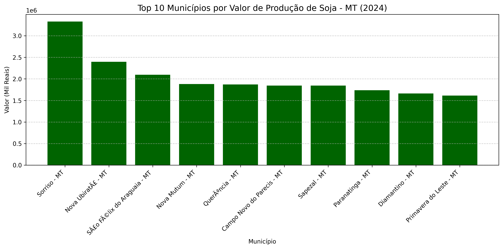

# 🌾 Análise de Produção de Soja - Mato Grosso (2024)

Este projeto realiza o levantamento e a análise do valor de produção de soja nos municípios do estado de Mato Grosso, utilizando dados extraídos do **IBGE (Instituto Brasileiro de Geografia e Estatística)**.

O objetivo é demonstrar habilidades em limpeza de dados (Data Cleaning), modularização de código em Python e visualização de dados para identificar os principais polos produtores da região.

## 🛠️ Tecnologias e Ferramentas
- **Linguagem:** Python 3.11
- **Bibliotecas:** Pandas (Manipulação), Matplotlib (Visualização)
- **Ambiente:** Jupyter Notebooks (VS Code)

## 📁 Estrutura do Projeto
- `data/`: Contém o dataset bruto em CSV.
- `notebooks/`: Notebook principal com o passo a passo da análise.
- `src/`: Contém scripts auxiliares e funções modulares (limpeza de dados).
- `requirements.txt`: Lista de dependências para reprodução do ambiente.

## 📊 Destaques da Análise

### 1. Limpeza de Dados (Data Cleaning)
Os dados brutos do IBGE apresentavam desafios comuns em dados reais:
- Valores nulos representados por caracteres especiais (`-`).
- Números formatados como texto com separadores de milhar brasileiros (pontos).
- **Solução:** Implementação de uma função modular em `src/utils.py` para automação do tratamento desses dados.

### 2. Principais Insights
Através da análise, foi possível identificar:
- O município de **Sorriso - MT** como líder absoluto em valor de produção, superando significativamente os demais municípios do Top 10.
- Uma visão clara da concentração de riqueza agrícola em regiões específicas do estado.


## 🚀 Como Executar o Projeto

1. Clone o repositório:
   ```bash
   git clone [https://github.com/vitor-garcia83/analise-commodities-agricolas.git](https://github.com/vitor-garcia83/analise-commodities-agricolas.git)

2. Instale as dependências:
pip install -r requirements.txt

3. Abra o VS Code e execute o arquivo notebooks/analise_commodities.ipynb.

Autor: Vítor Hugo Sátiro